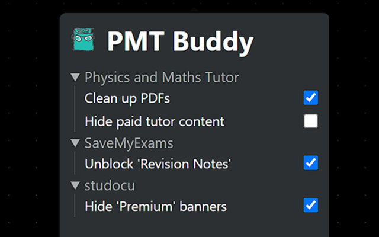

<h1 align="left">
	
	
	
	PMT Buddy
</h1>

    <a href="https://chromewebstore.google.com/detail/pmt-buddy/moepnndepfamgglegngndbagiobmhpop">
    	<picture>
      		<source srcset="https://i.imgur.com/XBIE9pk.png" media="(prefers-color-scheme: dark)">
      		
		</picture>
	</a> 
	

---

This extension contains features intended to improve your experience on revision websites, by removing promotional content and distractions, or adding elements, to let you focus on what you're really there for!

 </img>

---

## Supported websites and features

| Website                                                         | Features                                |
| --------------------------------------------------------------- | --------------------------------------- |
| [Physics and Maths Tutor](https://www.physicsandmathstutor.com) | Clean up PDFs, Hide paid tutor content. |
| [SaveMyExams](https://www.savemyexams.com)                      | Unblock 'Revision Notes'                |
| [studocu](https://www.studocu.com/)                             | Hide 'Premium' banners                  |

---

## Credits

- [Chrome Extension Developer Tools](https://marketplace.visualstudio.com/items?itemName=aaravb.chrome-extension-developer-tools) was used to generate this extension's template.

## Contributing

Thank you for wanting to improve PMT Buddy! This is mainly my personal project to help develop my programming skills but I am open to contributions.

### Building

- Download required libraries with `npm install`
- Debug with `npm run watch`
- Build with `npm run build`, then zip the contents of the `build` folder.

### Extension structure

- `public` contains the `manifest.json`, `popup.html`, and any other assets used for the HTML.
- `src` contains CSS and JS files.
    - `modules` contains folders for each of the websites, and `index.js` runs each feature.
    - `utils` has some helper classes and functions.
    - `background.js` is the service worker.
    - `contentScript.js` redirects to `./modules/index.js`.
    - `popup.js` is run when the extension popup is opened.
