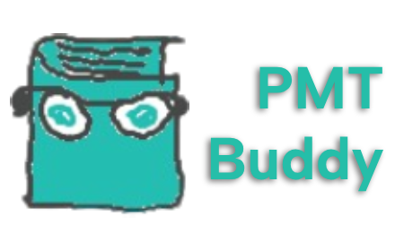

<h1 align="left">
	
	
	
</h1>

    <a href="https://chromewebstore.google.com/detail/pmt-buddy/moepnndepfamgglegngndbagiobmhpop">
    	<picture>
      		<source srcset="https://i.imgur.com/XBIE9pk.png" media="(prefers-color-scheme: dark)">
      		
		</picture>
	</a>

---

This extension contains features intended to improve your experience on revision websites, by removing promotional content and distractions, or adding elements, to let you focus on what you're really there for!

 </img>

---

## Supported websites and features

Physics and Maths Tutor

  ● Redirect to .co.uk: Redirects the currently unusable .com domain to the .co.uk domain.  
  ● Clean up PDFs: Redirects PDFs to the original source to remove the white sidebar.  
  ● Hide unnecessary elements: Hides some unneeded elements like the massive white bar on the top.  
  ● Hide paid tutor content: Hides most paid PMT Education content.  

SaveMyExams

  ● Unblock 'Revision Notes': View revision notes without logging in.  
  ● Remove premium plan offer banners: Removes the premium plan offer banners, including Black Friday sales. (currently broken)  

studocu

  ● Hide 'Premium' banners: Hides annoying banner on premium documents (cannot unblur pages).  

---

## Credits

- [Chrome Extension Developer Tools](https://marketplace.visualstudio.com/items?itemName=aaravb.chrome-extension-developer-tools) was used to generate this extension's template.

## Contributing

Thank you for wanting to improve PMT Buddy! This is mainly my personal project to help develop my programming skills but I am open to contributions.

### Building

- Download required libraries with `npm install`
- Debug with `npm run watch`
- Build with `scripts/build.py`

### Extension structure

- `scripts` contains scripts used to generate the extension zip.
- `public` contains the `manifest.json`, `popup.html`, and any other assets used for the HTML.
- `src` contains CSS and JS files.
    - `modules` contains folders for each of the websites, and `index.js` runs each feature.
    - `utils` has some helper classes and functions.
    - `background.js` is the service worker.
    - `contentScript.js` redirects to `./modules/index.js`.
    - `popup.js` is run when the extension popup is opened.
