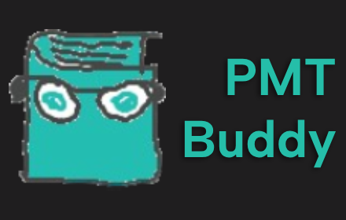

This extension contains features intended to improve your experience on revision websites, by removing promotional content and distractions, or adding elements, to let you focus on what you're really there for!

PMT Buddy is open-source! https://github.com/realooffyy/PMT-Buddy
Issues can be created in this repository.

